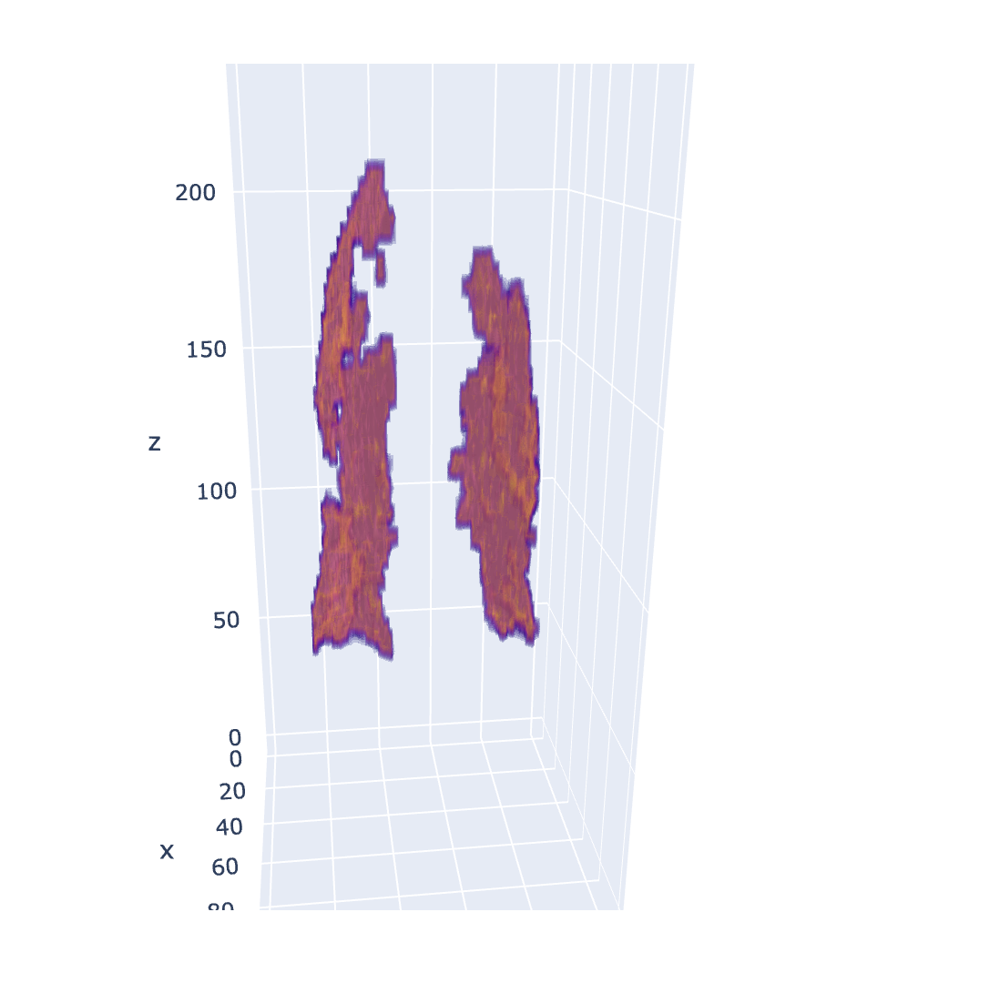
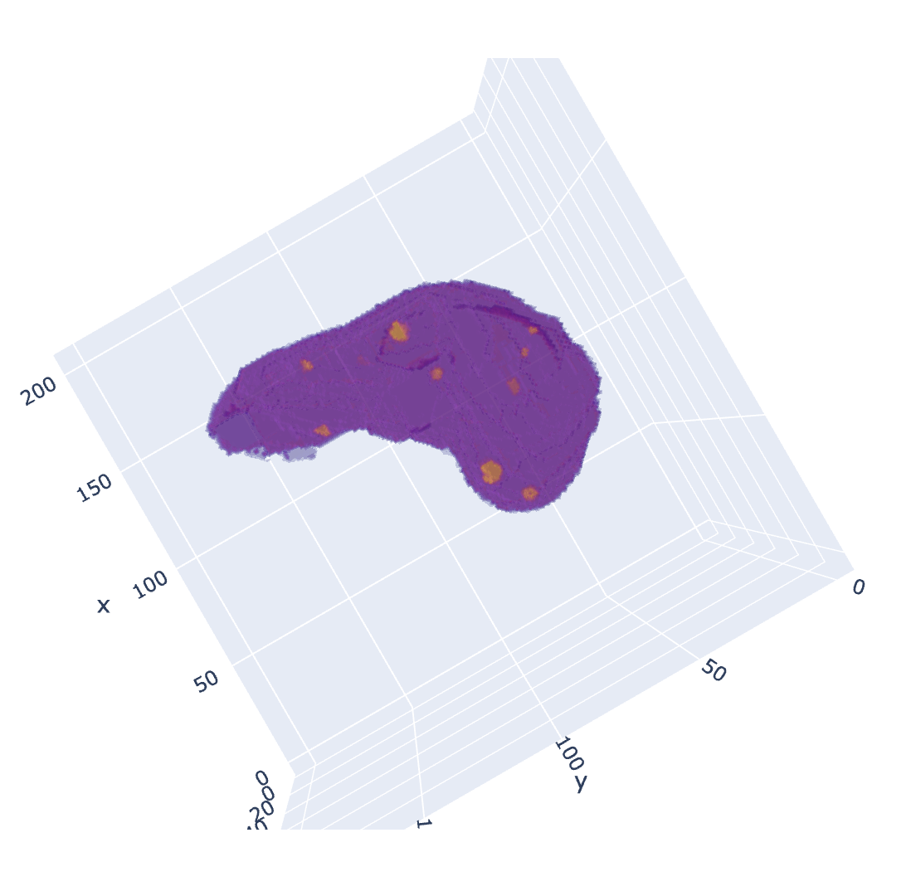

# Visualize Segmentation Masks

This function creates a 3D plot of the segmentation mask using  `plotly`.  

The plot can be extracted to a html file and can be viewed with your browser. Here are some fo the plots generated.   

Covid Infection mask            |  Liver Tumor mask (with organ)
:-------------------------:|:-------------------------:
 | 

`mask_visualize.py` is the source file for the function `plotmask()`. The function takes mask as the input. The mask should be a numpy array with categorical values for the mask.  

You can also change the `zoom_ratio` to make the plot look bigger or smaller than the original dimensions of the mask. Plotly takes time to render the plots and consumes a lot of memory. So, it is safe to reduce the dimensions significantly to 40% or 10% of original for a faster rendering and safe display without crashes.  

`enlarge_by` enables you to enlarge the pixels and gives you bigger view of the organs or segmentations.  

`img_type` gives you an option to choose the type of image as either html or png. Html format is interactive while png is static. Default is 'html'.  

`show_img` to display image from console. Default is False.  

`renderer` is an option given to plotly to render the plot on a given platform you are using. You can refer to [Plotly](https://plotly.com/python/renderers/) for more information on renderers.  

#### Credits

Data for liver lesions: [Kaggle - Liver Tumor Segmentation](https://www.kaggle.com/datasets/andrewmvd/liver-tumor-segmentation)  
Data for Covid infection masks: [Kaggle - COVID-19 CT scans](https://www.kaggle.com/datasets/andrewmvd/covid19-ct-scans)  
Thanks to this amazing tutorial by [MrPSolver](https://www.youtube.com/@MrPSolver)
